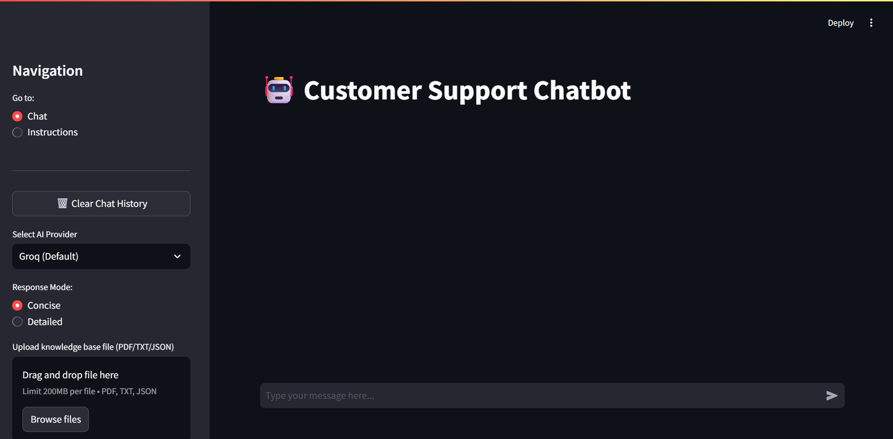

# Customer Support Chatbot

An AI-powered customer support chatbot built with **Streamlit** and **LangChain**.
It can:

* Answer questions directly using **pre-loaded knowledge** (FAQs, manuals, troubleshooting docs).
* Let users **directly type queries** without uploading files — it will fetch answers from pre-loaded knowledge or the web.
* Accept **uploaded PDF/TXT/JSON files** and index them on the fly.
* Choose between **Groq (Llama-3.1)**, **OpenAI GPT-3.5**, or **Google Gemini** models.
* Fall back to SerpAPI for web search if no answer is found in the internal knowledge base.

---
## Screenshot


## Features

* **Retrieval-Augmented Generation (RAG)**: answers from `knowledge_docs` or uploaded files.
* **Multi-model Support**: Groq (default), OpenAI, Gemini.
* **Embeddings**: uses GroqEmbeddings if available; falls back to OpenAIEmbeddings.
* **Vector Store**: FAISS for fast similarity search.
* **Web Search**: optional SerpAI Search integration.
* **Streamlit UI**: chat history, file upload, provider selector.
* **Flexible Usage**: users can upload files or just type questions directly.

---

## Project Structure

```
.
├── app.py                  # Streamlit main app
├── models/
│   └── llm.py              # Functions to get Groq/OpenAI/Gemini chat models
├── utils/
│   ├── rag_utils.py        # Load knowledge_docs & retrieve answers
│   └── web_search.py       # Bing search fallback
├── embeddings.py           # Precompute embeddings for local docs
├── config/
│   └── config.py           # API keys here
├── knowledge_docs/         # Your manuals, FAQs, troubleshooting docs
│   ├── manuals/
│   │   └── user_manual.pdf
│   ├── faqs/
│   │   ├── faqs.txt
│   │   └── faq.json
│   └── troubleshooting/
│       └── troubleshooting.txt
├──assets/
│   └── screenshot.png
└── requirements.txt
```

---

## Setup API Keys

Edit `config/config.py` and set:

```python
OPENAI_API_KEY = "your_openai_key"
GROQ_API_KEY = "your_groq_key"
GEMINI_API_KEY = "your_gemini_key"
SERPAPI_KEY = "SERPAPI_KEY"  # optional, for web_search
```

---

## Installation

```bash
git clone <your-repo>
cd <your-repo>
pip install -r requirements.txt
```

If you plan to use GroqEmbeddings, install its package:

```bash
pip install langchain_groq
```

---

## Running the App

```bash
streamlit run app.py
```

Open the provided localhost URL in your browser.

---

## Usage

### 1. Direct Search (No Upload Needed)

* Simply type your question in the chat input.
* The bot will first search **pre-loaded knowledge\_docs**.
* If nothing matches, it will perform a **web search** via Bing.

### 2. Upload Your Own File

* In the sidebar, upload a PDF/TXT/JSON file.
* The file will be chunked, embedded (Groq/OpenAI), and indexed.
* Chatbot will use the new knowledge base for answers.

### 3. Model Selection

* Sidebar dropdown: choose Groq (default), OpenAI, or Google Gemini.
* Responses can be **Concise** or **Detailed**.

---

## Precomputing Embeddings (Optional)

You can precompute all `knowledge_docs` embeddings and save them locally:

```bash
python embeddings.py
```

This creates `vector_store.pkl` for faster startup.

---

## How It Works (Flow)

1. **app.py** launches the Streamlit UI.
2. User chooses **model** and optionally uploads a file.
3. `process_uploaded_file()` splits & embeds uploaded docs → stores in FAISS.
4. Chat input builds **context** from FAISS (uploaded or pre-loaded docs).
5. If no context, fallback uses **RAG** or **web search** (`rag_utils.py`, `web_search.py`).
6. `get_chat_model()` in `models/llm.py` returns the right model.
7. `get_chat_response()` sends messages to the model → returns answer.
8. Streamlit displays the conversation live.

---


